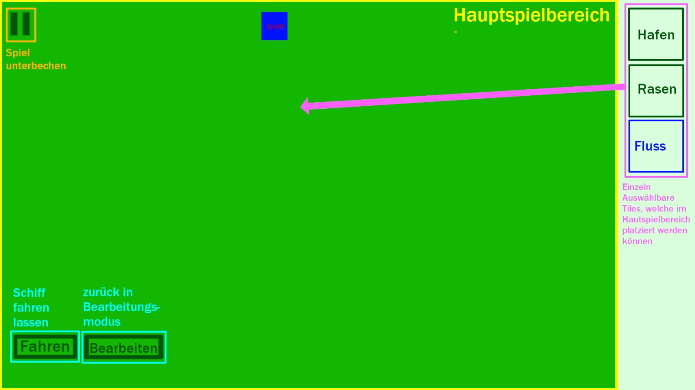

# Einleitung

Entwicklung eines konstruktivistischen Lernspiels zur Vermittlung von ersten Programmierkompetenzen mit Hilfe einer visuellen Abstraktion des Control Flows.

Teammitglieder:

- Freydank, Julius
- Hilse, Elia
- Kramp, Edwin
- Lochner, Jonas
- Sander, Lucas
- Schmidt, Jonathan
- Schneider, Jan Erik

Dozenten:

- Kazimiers, Antje
- Rudolph, Michael

---

# Game Overview

## Spielkonzept

Titel: **Freight Flow**

Story:

- Lieferauftrag, mit dem Schiff verschiedene Häfen zu beliefern 
  - Ziel: Logistik verbessern

Technologie:

- Engine: Godot
- Betriebssystem: Windows, (Multi-Platform via Web)
- Eingabemethode: Multitouch

Gameplay:

- Objective für Level wird durch Bezugsperson präsentiert
- Spieler platzieren Objekte (Häfen, Schranken, etc.) 
  - Häfen → Variablen-Assignments && Rechenoperationen
  - Schranken ++ Abzweigung → Bedingung
- Spieler formen den Flussverlauf mittels Fluss-Abschnitten 
  - Kreissegment → Schleife
  - Schranke + Abzweigung → Bedingung
- Ein Schiff fährt den Fluss entlang und visualisiert somit spielerisch den Ablauf des Programmes. An Häfen werden z.B. 2 Container aufgeladen wenn die Variable mit 2 summiert wird, etc. Das Schiff hat einen Anhänger pro Variable 
  - Anhänger und Häfen sind farbkodiert → Zugehörigkeit bzgl. Operationen leicht erfassbar

→ Kooperativ → Mehrere Spieler können dank Multitouch gleichzeitig am selben Problem arbeiten

- Ablauf:
  1. (Spieleranzahl wird eingegeben)
  2. Level wird ausgewählt → Level 0 = Tutorial wird angezeigt
  3. Level startet → siehe Gameplay
  4. nächstes Level wird freigeschaltet
- Progression:

  → Mehrere Levels, Programmierkonzepte bauen aufeinander auf (von einer Variable zu mehreren, ohne Control-Flow zu Schleifen und Verzweigungen (evtl. von Integer zu Float))
- Anlehnung an:
  - Cosmic Express
  - Scratch

## Genre

- Puzzle Spiel mit Fokus auf die Anwendung von Logik für die Lösung grundlegender algorithmischer Probleme im Bereich der Programmierkompetenzen
- Zugrundeliegende Theorie: Konstruktivismus

Optik:

- Top-Down “schräg” → 2D-Hybrid
- Kein Realismus → stilisiert
- Simpel

---

# Analyse nach Addie

## Zielgruppe:

- 6\.-7. Klasse ca. (→ ~ ab 12 Jahren)
- Geschlechterverteilung irrelevant
- Kein Vorwissen

## Rahmenbedingungen

- Rahmenbedingungen:
- Lehrperson sollte über gewisses Grundwissen verfügen um Notfalls aushelfen zu können
- entsprechend fähige Hardware um problemlose Nutzung zu garantieren
- Lehrperson sollte entsprechend Zeit im Unterricht einplanen

## Lerngegenstand

- Ausbildung logischer Fähigkeiten im Bezug auf Problemlösungskompetenzen im Bereich der Programmierfertigkeiten
- Konzeptuell: 
  - Die Schüler sollen ein Verständnis für die Anwendung von Verzweigungen und Schleifen und Nutzung simpler, mathematischer Operationen entwickeln, um Probleme damit zu lösen.
- Prozedural 
  - Verständnis der Zusammenarbeit von Control Flow Elementen und des daraus entstehenden Gesamtalgorithmus

## Vorwissen

- Bedienung von Touch-Displays
- Auditive, Visuelle und Motorische Fähigkeiten auf einem dem Alter angemessenem Stand
- (Gutes) Logisches Verständnis auf Stand der 6. Klasse

## Ressourcen

- Ein Multitouch fähiges Gerät mit ausreichend großem Display
- Bei Erstanwendung eine Dreiviertelstunde → nach Einführung können Level auch je nach Fähigkeit deutlich schneller gelöst werden

## Ableitung der Grobziele

Die Schüler sind nach Abschluss aller Level befähigt in einer abstrahierten visuellen Programmierumgebung grundlegende algorithmische Probleme zu verstehen und Lösungen anhand der ihnen gegebenen Mittel zu erarbeiten. Sie beherrschen dazu die Anwendung von Verzweigungen, Schleifen und Variablen. Der zu erlernende Ablauf ist in jedem Level in Form eines Rätsels zu erarbeiten und sorgt damit dafür, dass durch die Visualisierung des Konzepts die Idee leichter vermittelt wird.

---

# Konzeption und didaktisches Design

### Lernumgebung

- Für die prototypische Umsetzung des Lernspiels ist die Lernumgebung auf Godot festgelegt.

### Ableitung der Feinziele

- Die Schüler können die visuelle Programmierumgebung verstehen und mit ihr eigene Programmabläufe bauen
- Die Schüler können Schleifen verstehen und in Problemen zur Lösung anwenden
- Die Schüler können Verzweigungen verstehen und in Problemen zur Lösung anwenden
- Die Schüler können Variablen verstehen und in Problemen zur Lösung anwenden

### Segmentierung und Gewichtung

- pädagogische Strategie:
  - Wiederholung: durch häufiges Wiederholen wird die Lernende Person sich auf Dauer den Lerninhalt besser merken können
  - steigender Schwierigkeitsgrad: durch Level, die mit fortschreitendem Spiel schwieriger werden wird die erwähnte Wiederholung nicht zu eintönig und zudem wird die Lernende Person weiterhin gefordert, obwohl das Grundkonzept das selbe bleibt

### Suche nach (vorhandenen Material)

Andere Spiele, die ähnliche Ziele verfolgen sind Scratch und CodeCombat.

### Game Flow

- Spiel:
  - Bewegung im Spiel sehr linear (Level zu Level)
  - Steuerung durch Touch
  - Platzieren von Bausteinen aus Menü auf Spielfläche

### Look and Feel

### Integration Pädagogisches Szenario

- Spiel kann Anwendung im Informatikunterricht finden
- Kann dort für jüngere Schüler direkt als Spielerischer Einstieg in den Unterricht genutzt werden um grundlegende Techniken zu vermitteln
- Überprüfung des Lernerfolgs durch Voranschreiten im Spiel oder kurze Wissensabfrage im Unterricht

---

# Gameplay und Mechanik

### Gameplay

- Map gestaltet sich interaktiv mit den Benutzereingaben
- Aktionen:
  - Platzieren von Bausteinen (Häfen, Schleifen, Bedingungen, Flussabschnitte)
  - Interaktion der verschiedenen Bausteine durch Häfen, an denen Variablen verändert werden
  - Balance:
    - 4 elementare Aktionen
    - Aktionen sind Vorrausetzung für funktionierende Map
    - ein Hauptobjekt mit überschaubarer Anzahl Unterobjekte
    - Objekt steht in enger Beziehung zu elementaren Aktionen

### Spielmechanik

Spielraum:

- Fluss mit Abzweigungen auf dem sich ein Boot bewegt, das eine unterschiedliche Zahl von Containern transportiert und auf Basis dieser verschiedene Wege befährt um zum Ziel zu gelangen

Zeit:

- rundenbasiertes Gameplay (erst Blöcke platzieren, dann fährt Boot gebaute Strecke ab)
- keine aktive Zeitbegrenzung (Hilfestellung nach vermehrtem Fehlversuch)
- Lernende bestimmen aktiv die Dauer des Spiels, mögliche Einschränkung wäre Unterrichtszeit
- Spiel zwingt den Lernenden nicht, das Spiel in einer Sitzung zu beenden
- Level bauen aufeinander auf mit steigendem Schwierigkeitsgrad und und somit voraussichtlich  steigender Lösungsdauer für einzelne Level
- Zeitlimit würde Gameplay zwar spannender machen, würde aber zeitlich den Lerneffekt deutlich reduzieren, sowie das Stressnivau steigern -> keine sinnvolle Funktion
- zeitlich unabhängige Spielrunden (Level) die zeitlich unabhängig voneinander sind

Objekte, Attribute und Statusangaben:

- Objekte im Spiel sind das Schiff und die Häfen
  
- Schiffsattribute:
  - Position auf dem Fluss
  - Anzahl der Container und Anhänger

  

- Hafenattribute:
  - Anzahl verschiedener verfügbarer Container
  - Position im Flusslauf

  

- Status von Position ist die Position (Koordinate)
- Status der Anzahl ist eine Zahl, welche sich im Bereich der positiven natürliche Zahlen befindet
- Alle Informationen sind allen Spielern zugänglich

Kernmechanik:

- Spieler lösen ein vorgegebenes Problem, in dem sie je nach Freiheitsgrad des Levels:
  - die Operationen an Häfen konfigurieren
  - die Bedingungen an Schranken setzen
  - den Flussverlauf via Flussabschnitten / Schleifen bestimmen
  - Häfen platzieren
  - Schranken platzieren

\-> Problem kann z.B. das Erreichen eines Ziels, oder das korrekte erfüllen der Liefervorgaben an mehreren Häfen sein

Regeln:

- Spieler verwenden lediglich die in dem jeweiligen Level zur Verfügung gestellten Ressourcen bzw. Möglichkeiten (je nach Freiheitsgrad des Levels können das z.B. das konfigurieren verschiedener Operationen an den bereitgestellten Häfen, oder das platzieren von Häfen/Schranken selbst sein, etc.)

  

Spielziel:

- das Schiff soll am Ende des Levels das Ziel, mögliche damit Verbundene Bedingungen und mögliche Objectives erfolgreich erreicht haben
- Ziel und dorthin führender Weg sind klar und deutlich erkennbar

### Game Options

- platzieren von Bausteinen auf verschiedene Art und Weise um erfolgreich ans Ziel zu gelangen
- Map dadurch nach persönlicher Präferenz in kleinem Rahmen eigenständig gestaltbar

### Einschränkungen

- der Lernende sollte durch logisches Denken auf simpelsten und schnellsten Wege das Ziel erreichen
- sequentielles Denken wird gefördert und Ablauf in festgelegter Reihe
- Lernende sollten überkomplexes, nicht zielführendes Denken vermeiden

---

# Story, Setting und Charaktere

### Story und Narrativ

- keine Story, da diese weder notwendig noch zielführend wäre

### Spielwelt

- Der Spieler befindet sich mit seinem Schiff in einem Kanal im Grünen.
- Es befinden sich Häfen an diesem Kanal, an denen Ladung verfrachtet wird.
- Die Umgebung ist eher ruhig.
- Die Atmosphäre des Spiels ist eher ruhig, gelassen und bodenständig, was durch ein nicht vorhandenes Zeitlimit gefördert wird.

### Charaktere/Pädagogische Agenten

- Kapitän, welcher in Textboxen die Grundprinzipien des Spiels schrittweise erklärt
- Die Textboxen enthalten überwiegend Informationen, wie das Spiel gespielt wird und welche Funktionalitäten existieren

---

# Leveldesign

### Übungslevel

- Das Spiel beginnt mit Tutorial-Levels, in denen fortlaufend die einzelnen Funktionen gezeigt und erklärt werden
- Die Funktionen sind die Funktionalität der Häfen, wie Abzweigungen funktionieren und wie Schleifen gekonnt angewandt werden.

### Bewertung/Wertung/Belohnung

- Das in den Tutorials erlangte Wissen soll in fortlaufend immer schwerer werdenden Levels genutzt werden.

---

# Interface

### Entwurf

- Spielplan:
  - Der Spieler soll Flussabschnitte platzieren, auf denen sich das Schiff bewegt.
  - Das Schiff wird an den Häfen mit Waren beladen, welche es benötigt um an das Ziel zu gelangen

### Physical System

- Flussabschnitte, Häfen und weitere Elemente können durch den Lernenden via Touch-Interaktionen auf der Map platziert werden
- Die Interaktionen definieren direkt den Ablauf des Spiels
- Ein sinnvoll zu verwendendes zusätzliches Ausgabegerät neben dem Bildschirm wäre eine Soundausgabequelle, welche dem Spieler Soundfeeback gibt

### Visual System

- Der Spieler sieht ein Menü, aus welchem Tiles gewählt und platziert werden können
- Das Spiel wird von einer Top-Down-Perspektive gespielt im Stil eines 2D-3D-Hybriden (siehe Look and Feel)

### Control System

- Sehr intuitives Gameplay durch Touch DragAndDrop
- Spieler bekommen ein großes Gefühl des Einflusses über das Spiel, da das Konzept des Spiels auf Interaktion und Gestaltung der Map beruht
- Der Spieler hat die Möglichkeit, die Map nach eigenem belieben zu gestalten und zu verändern

### Transparenz

- Das Interface ist sehr leicht zu verstehen und sehr übersichtlich, wodurch die Spieler einen leichten Einstieg ins Spiel erlangen
- Das Interface ist sehr intuitiv, da die verwendeten Funktionen auch viel im Alltag mit beispielweise Smartphones genutzt werden
- Da kein Zeitlimit vorhanden ist können die Lernenden im eigenen Tempo Levels bauen und somit entstehen auch keine stressigen Situationen
- Falls der Spieler vergessen sollte, was ein Tile macht, kann die ein tippen, auf ein dort vorhandenes Fragezeichen, noch einmal eine Textbox hervorgerufen werden, welche die spezifische Funktion erklärt 

### Feedback

- Die Spieler müssen nur das Ziel des Spiels, als auch die Funktionalität der Tiles kennen, welche immer wieder erneut erklärt werden kann
- Die Zielsetzung der Level wird durch das markierte Ziel klar definiert und die Lernenden erhalten ein visuelles als auch ein Audiofeedback bei gescheiterten Versuchen 

### Audio, Musik, Soundeffekte

- Das Spiel soll Hintergrundmusik, einen Win-/Fail-Sound enthalten und optional noch Sounds, welche an Stellen wie Häfen hörbar sind

### Hilfesysteme

- Als Hilfesysteme sind die Tutorials als auch die Fragezeichen neben den Tiles in der Tilebox geplant, welche die Funktionen der einzelnen Tiles erneut erklären geplant

---