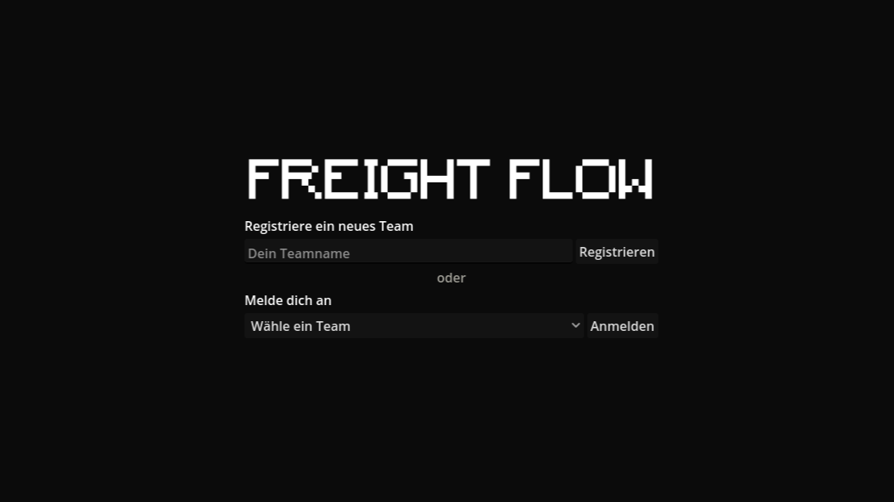
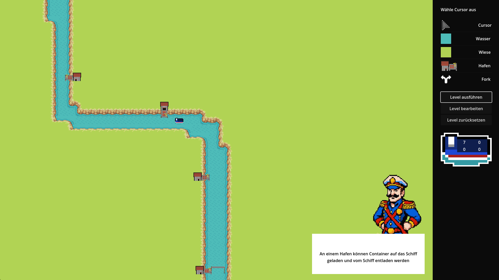
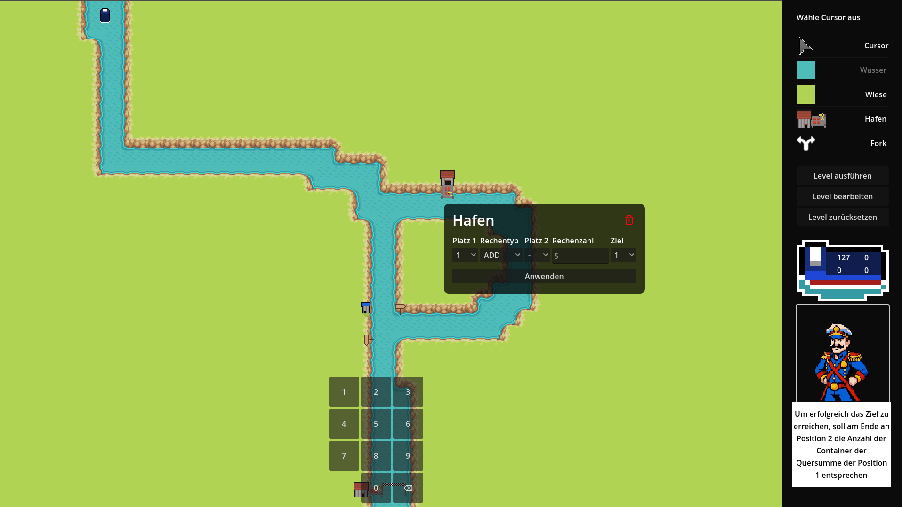

# FreightFlow

FreightFlow is a proof of concept for a sandbox game teaching programming concepts in an innovative way.\
See the Game Design Document in [German](docs/game-design-document.md) or [English](docs/game-design-document-en.md) for more information.

## Attributions

FreightFlow was a team project together with
[Edwin Kramp](https://github.com/EdwinKramp), [Julius Freydank](https://github.com/OfficerPaul) & [Jonathan Schmidt](https://github.com/ComputerCrack) at the [Chair of Didactics of Computer Science](https://tu-dresden.de/ing/informatik/smt/ddi?set_language=en) at [TU Dresden](https://tu-dresden.de/?set_language=en).

## Game

### Stack
GoDot 4.2.2

### Theming
Color for UI backgrounds is: `#0b0b0b`

### Compatibility

#### Input
Click, Touch, Multi-Touch

#### Operating Systems
Windows 7, 8, 10 & 11\
Linux (Ubuntu 22.04)

### Screenshots

### Game-Related Attributions

#### Captains Voice

The captain's voice-lines were generated using [ElevenLabs](https://elevenlabs.io/).

## Website

### Stack

NextJS 14 (React, Typescript, TailwindCSS), statically exported.
Deployed [here](https://freightflow.elia.vc) (via Cloudflare Pages).

